<h2 align="center">Natural disasters on three sport court scenarios</h2>

<h4 align="center">Snow Storm</h4>
<table>
<tbody>
<tr>
<td></td>
<td>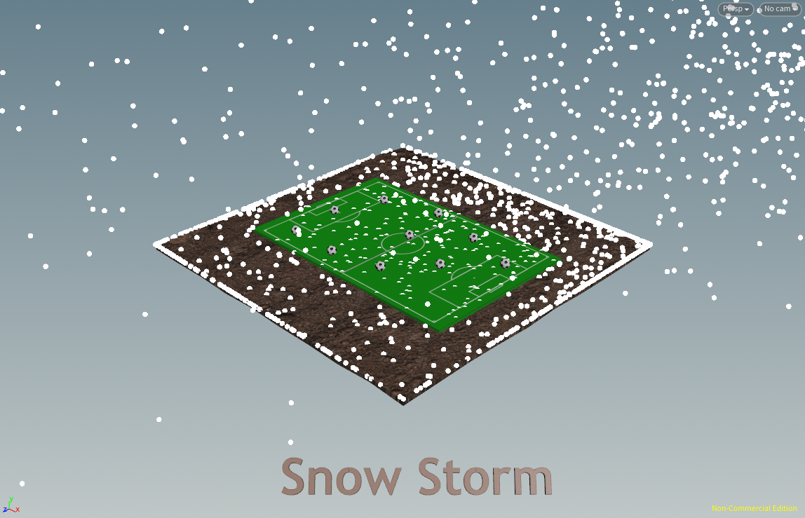</td>
</tr>
</tbody>
</table>
<h4 align="center">Earthquake</h4>
<table>
<tbody>
<tr>
<td>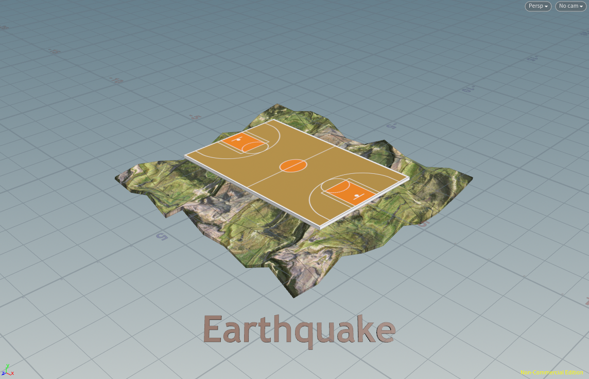</td>
<td>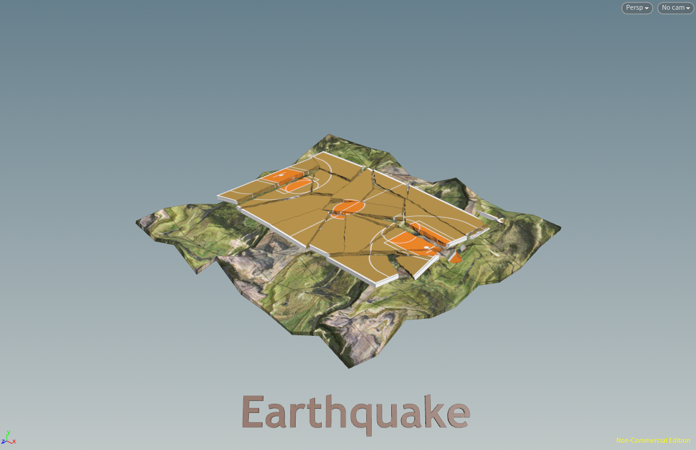</td>
</tr>
</tbody>
</table>
<h4 align="center">Heavy Rain</h4>
<table>
<tbody>
<tr>
<td>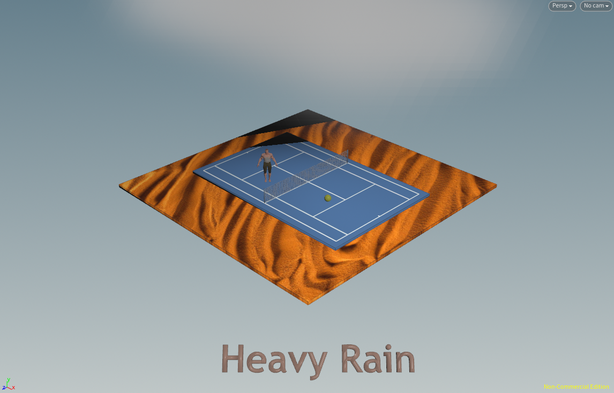</td>
<td>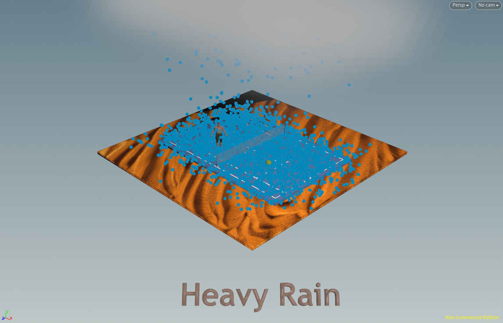</td>
</tr>
</tbody>
</table>
 

<h4 align="center">Images Used</h4>
<table>
<tbody>
<tr>
<th>soccer.png</th>
<th>basketball.png</th>
<th>blueish.jpg</th>
</tr>
<tr>
<td>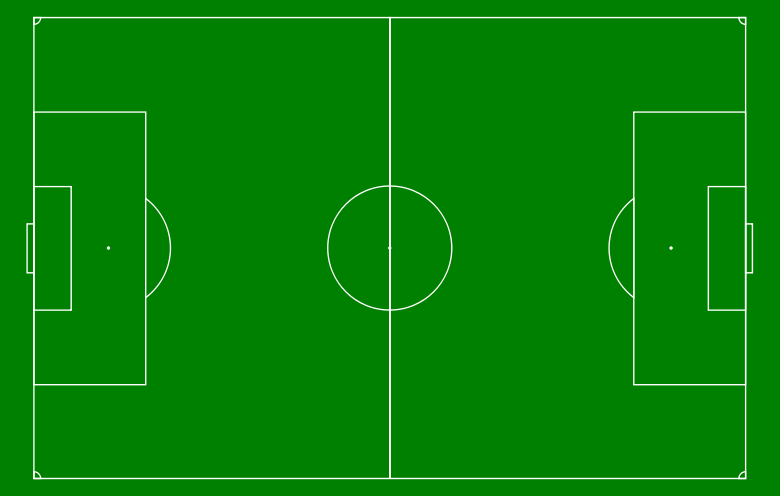</td>
<td>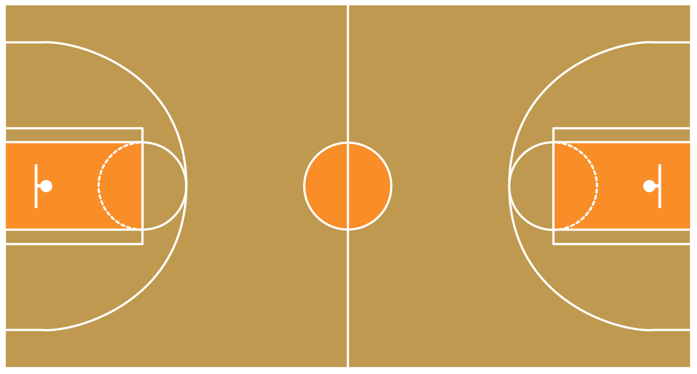</td>
<td>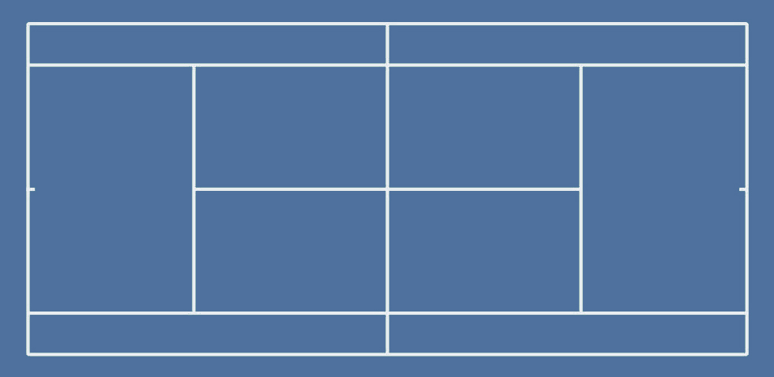</td>
</tr>
<tr>
<th>terrain3.jpg</th>
<th>terrain2.jpg</th>
<th>terrain5.jpeg</th>
</tr>
<tr>
<td>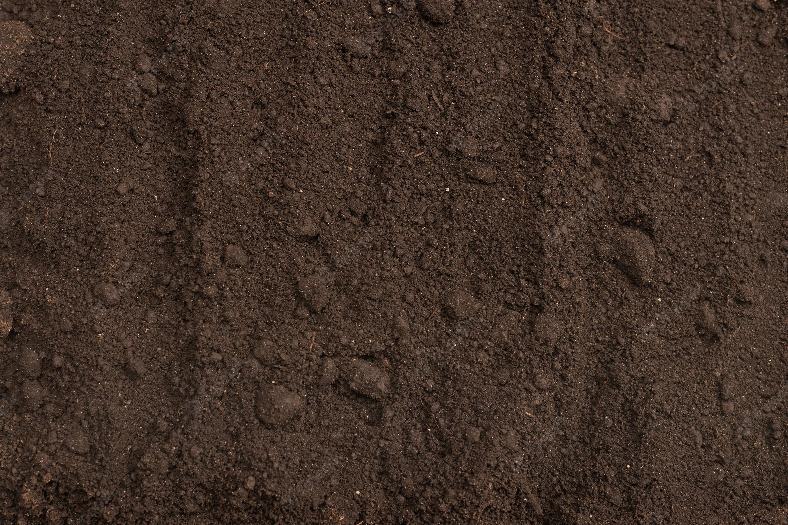</td>
<td>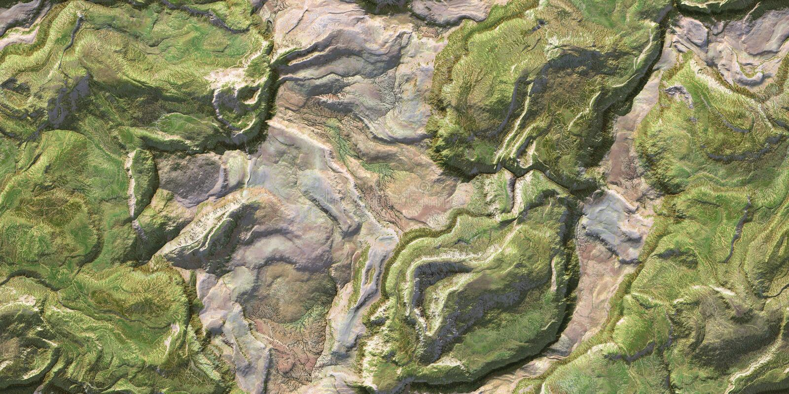</td>
<td>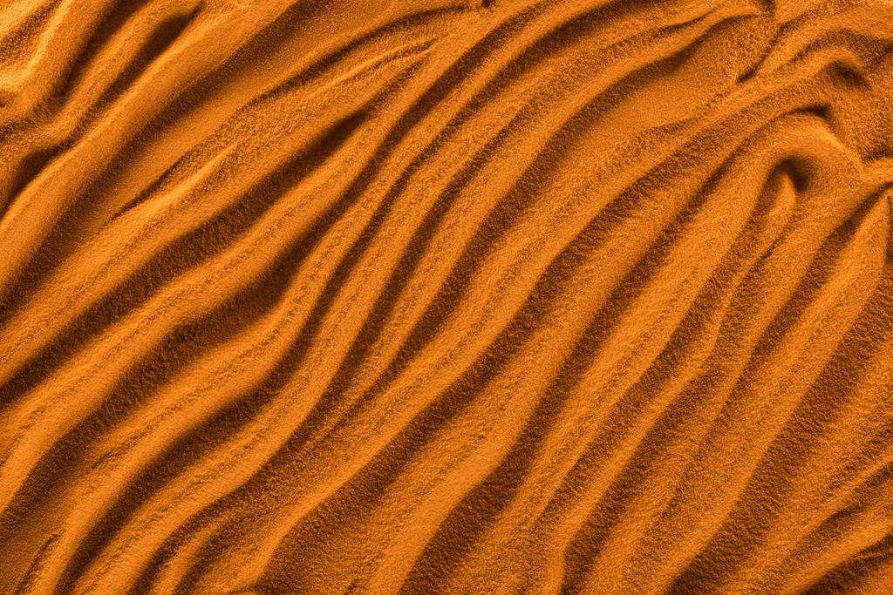</td>
</tr>
</tbody>
</table>

<h4 align="center">
Contributions, issues, and feature requests are welcome!       Give a ⭐️ if you like this project!</h4>

<h3 align="center">
  

 
</h3>
